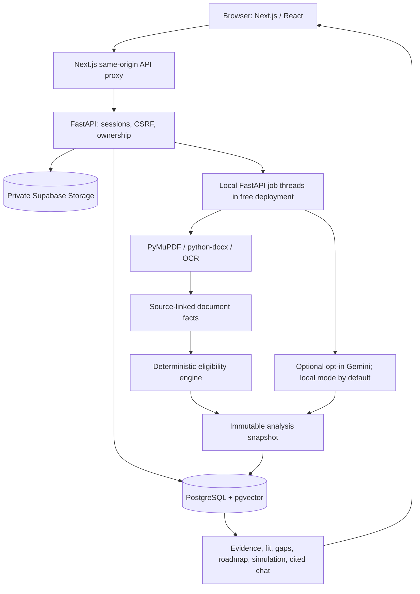
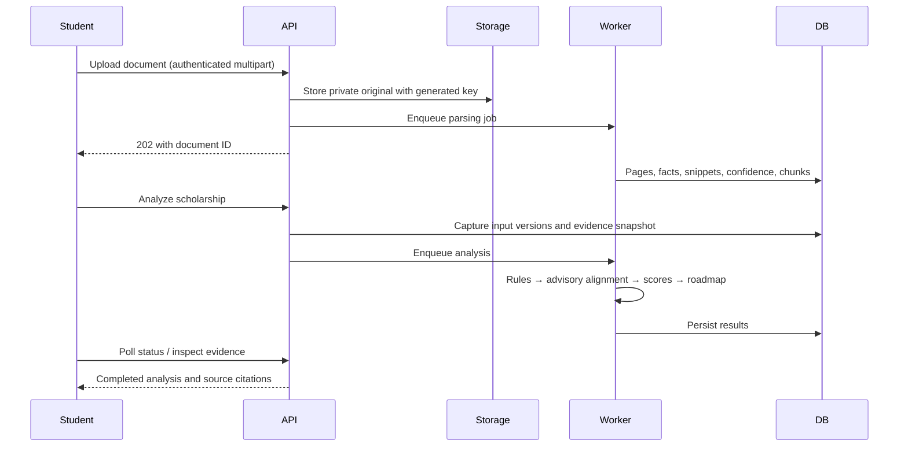
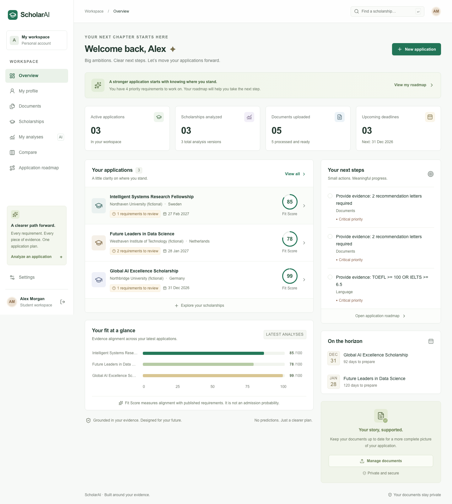

# ScholarAI

An evidence-based scholarship application workspace. Upload academic documents, add published program requirements, inspect deterministic eligibility decisions, compare transparent fit scores, and build an application plan.

**ScholarAI evaluates fit. It does not predict or guarantee admission.** All sample people, institutions, scholarships, and documents are fictional. No sample analysis is returned by production endpoints: demo results are generated by the same parsing and scoring pipeline as user applications.

## What is implemented

- Account registration/login/logout, Argon2 hashes, revocable sessions, CSRF protection, password reset and email-verification flows.
- Editable personal, academic, language, technical, research, professional and scholarship-goal profiles.
- Private PDF/DOCX/PNG/JPG uploads, asynchronous parsing, page/snippet evidence, fact correction history, downloads, deletion and retries.
- Scholarship intake from public URL, processed guide, or pasted text; structured requirements with source provenance; admin review and deactivation.
- Deterministic numeric/date/degree/field/document/boolean/AND/OR evaluation. Low confidence, conflicting facts and ambiguous language remain uncertain.
- Six configurable fit categories, explicit scoring coverage and formula, evidence drawers, strengths, gaps and prioritized roadmap tasks.
- Immutable analysis versions, What-If scenarios, comparison of up to four analyses, source-cited assistant, JSON exports and printable reports.
- Private, tenant-filtered pgvector retrieval; optional Gemini provider; deterministic local mode by default.
- Account export/deletion, external-AI opt-out, source/quality warnings, request IDs, health/readiness endpoints, tests and CI.

The free live architecture deploys the complete Next.js app to Vercel, FastAPI to Render, and durable data and private files to Supabase. See [Zero-Cost Live Deployment](docs/deployment/render.md) for setup and its limitations. A deployment is not considered live until the public checks in that guide pass.

## Repository

```text
apps/
  web/
    app/                   Next.js routes and responsive theme
    components/            Dashboard, evidence, documents, forms, planning, admin
    components/ui/         shadcn-compatible Button and Radix dialogs
    lib/                   Typed API client and display utilities
    types/                 Shared frontend response contracts
    tests/                 Vitest and Playwright workflow tests
  api/
    app/
      api/                 Authentication, profile, documents, scholarships, analysis routes
      auth/                Session/CSRF/password helpers
      core/                Environment and rate-limit configuration
      db/                  SQLAlchemy engine/session
      models/              Tenant-owned relational entities
      schemas/             Strict Pydantic request/extraction contracts
      services/            Snapshots, storage, retrieval, mail, URL security
      parsers/             PDF/DOCX/OCR, exact facts, requirements, metadata, quality
      scoring/             Deterministic rules and transparent weighting
      ai/                  Provider interface, compatible provider, local fixture provider
      tasks/               Celery/local background pipeline
      seed_demo_data.py    Idempotent synthetic demo seed
      manage.py            Operator-only administrator promotion
    alembic/               Explicit frozen database migration
    tests/fixtures/        Clearly marked synthetic PDF files
    pyproject.toml
    uv.lock
packages/shared/           Cross-service contract documentation
infra/docker/              Non-root application images
infra/nginx/               Optional reverse-proxy configuration
docs/architecture/         Scoring, security, deployment boundaries
docs/api/                  API usage and generated OpenAPI contract
docs/screenshots/          Browser verification artifacts
scripts/                   Local development launcher
.github/workflows/ci.yml   Lint, tests, build, E2E, Compose validation
```

## Architecture





## Technology

Next.js 16, React 19, strict TypeScript, Tailwind 4, Radix/shadcn-compatible primitives, React Hook Form, Zod, TanStack Query, Recharts and Lucide. Python 3.12, FastAPI, Pydantic, SQLAlchemy, Alembic, PostgreSQL/pgvector, Redis/Celery and S3/MinIO. JavaScript dependency resolution is in `package-lock.json`; Python resolution is in `apps/api/uv.lock`. Install from these lockfiles for reproducibility.

## Run with Docker Compose

Requires Docker Engine/Desktop with Compose v2. From the repository root:

```bash
cp .env.example .env
docker compose up --build
```

Open [ScholarAI](http://localhost:3000). Compose starts PostgreSQL, Redis, private MinIO, a one-shot bucket initializer, an explicit one-shot Alembic migration job, FastAPI, Celery, and Next.js. API startup itself never alters the schema. MinIO's local console is [localhost:9001](http://localhost:9001); the object API stays private to the Compose network.

Seed the optional synthetic workspace after services are healthy:

```bash
docker compose exec api python -m app.seed_demo_data
```

Demo credentials with the example development configuration:

| Field | Value |
| --- | --- |
| Email | `alex@scholarai.demo` |
| Password | `ScholarDemo!2027` |

Override `DEMO_PASSWORD` before seeding if desired. Demo seeding is disabled in production and will not overwrite an existing demo account. The demo includes Alex Morgan, five synthetic PDFs, three fictional scholarships, and analyses calculated by the normal application pipeline.

```bash
docker compose ps
docker compose logs -f worker
docker compose exec api python -c "import urllib.request; print(urllib.request.urlopen('http://localhost:8000/ready').read().decode())"
```

For the optional proxy: set `APP_URL=http://localhost:8080` in `.env`, then run `docker compose --profile proxy up --build`. For production, terminate TLS with your infrastructure gateway and use its HTTPS origin.

## Run without Docker

Requires Node.js 24, Python 3.12 and [uv](https://docs.astral.sh/uv/). Install Tesseract separately if testing images/scanned PDFs. Text PDFs and DOCX work without OCR. Local development uses SQLite, a two-thread background executor, private local files, and a conservative local provider. This mode requires no API key or external services.

Terminal 1:

```bash
npm ci
cd apps/api
uv sync --frozen --python 3.12
uv run alembic upgrade head
DEMO_PASSWORD='ScholarDemo!2027' uv run python -m app.seed_demo_data
uv run uvicorn app.main:app --host 127.0.0.1 --port 8000
```

Terminal 2, from the root:

```bash
npm run dev
```

Open [localhost:3000](http://localhost:3000), using this exact origin to match CSRF origin validation. `scripts/dev.sh` also installs Python dependencies, migrates, and starts both servers after `npm ci`. An `.env` in the root is for Compose; standalone FastAPI reads `apps/api/.env` or exported environment variables. Do not copy Compose hostnames such as `postgres` into a standalone local environment.

Local data lives under `apps/api/.data/`. Development verification/reset emails are written to private JSON files in `.data/mail/`; open the `url` field to complete the flow. Tokens expire in one hour. Hosted delivery is optional and uses Resend when configured.

## Configuration

See `.env.example` for the complete Compose configuration. For a standalone local demo, no variables are required except `DEMO_PASSWORD` when seeding.

| Variable | Purpose |
| --- | --- |
| `ENVIRONMENT` | `development`, `test`, or `production` |
| `DATABASE_URL` | SQLAlchemy PostgreSQL+psycopg URL; local SQLite default |
| `REDIS_URL` | Celery broker/results and distributed rate limiting |
| `APP_URL` | Exact trusted web origin, HTTPS in production |
| `TASK_MODE` | `celery`, `local`, or `eager` (tests only) |
| `STORAGE_BACKEND`, `STORAGE_PATH` | `s3` or private local development files |
| `S3_ENDPOINT`, `S3_ACCESS_KEY`, `S3_SECRET_KEY`, `S3_BUCKET` | Private object storage |
| `LLM_PROVIDER` | `mock` for local deterministic mode; `gemini` for optional Gemini |
| `GEMINI_API_KEY` | Optional server-only Gemini API credential |
| `LLM_CHAT_MODEL`, `LLM_EMBEDDING_MODEL` | Gemini model names: `gemini-3.5-flash-lite` and `gemini-embedding-2` by default |
| `EMBEDDING_DIMENSIONS` | 1536 for the initial pgvector schema; changing requires a migration and reindex |
| `RESEND_API_KEY`, `SMTP_FROM` | Optional Resend email delivery and verified sender |
| `DEMO_PASSWORD` | Local synthetic seed password; hosted demo login does not expose a password |
| `JWT_SECRET` | Reserved compatibility variable; sessions use random opaque DB-backed tokens, not JWTs |
| `API_INTERNAL_URL` | Next.js API destination, defaults to local port 8000; Docker build uses `api:8000` |

Production free mode requires HTTPS, PostgreSQL, private S3-compatible storage, and the same-origin proxy secret. It deliberately runs task jobs in the API process without Redis or Celery. Gemini and Resend are optional; deterministic extraction, rule evaluation and local embeddings work without them. Users must opt in before document excerpts or profile details are sent to Gemini.

## Zero-Cost Live Deployment

The target infrastructure cost is **$0.00/month** using provider free tiers: Vercel Hobby for the complete Next.js app, Render Free for one FastAPI web service, Supabase Free for PostgreSQL with `vector` and private document storage, Gemini API free tier for optional AI, and Resend Free for optional email. GitHub Pages remains a static marketing site with **Launch ScholarAI** and **Try Demo** links into the Vercel app. The Render Blueprint creates only a free web service; there is no Render database, worker, Redis, paid storage, or required AI key.

The live free tiers have limits. Render sleeps after inactivity and has temporary local disk, so lasting records and original files live in Supabase; its cold start may take about a minute. Supabase free projects have storage/database caps and can pause after inactivity. Vercel Hobby has request/build quotas and is intended for personal, non-commercial use. Gemini free-tier privacy terms differ from paid tiers, so ScholarAI disables external AI by default. When free quotas are reached, services can pause or reject work until their limits reset. Keep billing and paid upgrades disabled. See the [deployment guide](docs/deployment/render.md) for setup, CORS, secrets and verification.

`FREE_DEPLOYMENT_MODE=true` is the supported zero-cost live configuration. It uses short jobs on the API service and database-backed status polling. Redis/Celery remain available for local Docker and future non-free deployments, but are not provisioned or required here.

## AI provider setup

```dotenv
LLM_PROVIDER=gemini
GEMINI_API_KEY=<server-only-key>
LLM_CHAT_MODEL=gemini-3.5-flash-lite
LLM_EMBEDDING_MODEL=gemini-embedding-2
EMBEDDING_DIMENSIONS=1536
```

The provider interface exposes structured generation, chat, and embeddings. Schema validation retries malformed output safely. Source excerpts are validated, and exact numeric facts remain parsed by deterministic patterns. Mandatory rules never depend only on a semantic judgment. External AI receives only relevant excerpts and is unavailable until explicitly enabled by both deployment configuration and the account holder. On the Gemini free tier, Google may use submitted content to improve its products; see the privacy warning in Settings before opting in.

Changing provider/model requires reprocessing documents and creating new analyses; never mix vector models without reindexing. Local mode is explicitly labeled: lexical vectors are development fixtures, not trained semantic embeddings. The local assistant explains stored evaluations with sources and does not pretend to be generative AI.

## Database migrations and admin

```bash
cd apps/api
uv run alembic upgrade head
uv run alembic current
# Operator only, after the account has registered:
uv run python -m app.manage promote-admin admin@example.com
```

The initial migration is frozen. For future schema changes, add a new revision, review generated SQL, back up the database, and run migrations as a deployment job. Use an owner/migration role for `CREATE EXTENSION vector`; runtime credentials should have narrower privileges.

## Tests and validation

```bash
# Frontend lint + strict type check, unit tests, optimized build
npm run lint
npm run format:check -w apps/web
npm test
npm run build

# Backend deterministic rules, API integration, ownership, security and quality
cd apps/api
uv run ruff check app tests
uv run ruff format --check app tests
uv run pytest -q

# Browser workflow, with the API and web already running
cd ../..
npx --workspace apps/web playwright install chromium
npm run test:e2e
```

Seed the demo account before running both browser tests. The first browser test registers a new synthetic student, saves a profile, uploads CV/transcript/TOEFL PDFs, creates a scholarship, checks the exact TOEFL evidence, runs a hypothetical scenario, confirms the saved evidence is unchanged, and asks the evidence assistant a question. GitHub Actions runs backend/frontend checks, a browser workflow, and Compose configuration validation; it does not deploy.

See `docs/verification.md` for actual execution results and unverified infrastructure boundaries.

## Production build and deployment

```bash
npm ci
npm run build
docker compose build web api worker
# With production secrets, TLS gateway and appropriate infrastructure configured:
docker compose run --rm migrate
docker compose up -d api worker web
```

The web image uses Next.js standalone output; the API/worker images use locked Python dependencies and include OCR. Use a production secret manager rather than committed env files. Configure a trusted client-IP strategy at your reverse proxy. Health is `/health`; readiness checks database, optional Redis, and S3 at `/ready`. For the free live service, follow the deployment guide rather than this Docker Compose architecture.

## Evidence, security and API documentation

- [Scoring semantics and explainability](docs/architecture/scoring.md)
- [Security controls and deployment boundary](docs/architecture/security.md)
- [API workflow](docs/api/README.md)
- FastAPI interactive API docs: [localhost:8000/docs](http://localhost:8000/docs) in standalone development.

## Screenshots

Browser-verified screenshots show only the synthetic demo workspace.



- [Mobile dashboard](docs/screenshots/dashboard-mobile.png)
- [Requirement evidence](docs/screenshots/analysis-evidence.png)
- [Printable report](docs/screenshots/printable-report.png)

## Known limitations

- MinIO is for local development. The free live deployment uses Supabase's private S3-compatible Storage API.
- Docker is not installed on the implementation host. Compose service startup, PostgreSQL/pgvector runtime behavior, Redis/Celery delivery and MinIO integration need execution in a Docker-capable environment; local validation uses SQLite/files/thread jobs.
- Free external services and API credentials still need to be configured in their dashboards before a public deployment can be validated. Gemini and email are optional; the rule engine works without either.
- OCR needs the Tesseract binary (bundled in Docker). Poor scans, unusual transcripts, multilingual layouts, complex GPA scales, conditional eligibility, and ambiguous sources can require manual review. DOCX page 1 means a text section, not a rendered pagination claim.
- Automatic URL metadata extraction is deliberately conservative. It reads explicit labels; missing deadlines/funding are shown as unspecified. Requirements are never invented to fill gaps.
- Document-quality checks flag explicit expiry dates, pagination discrepancies, and obvious category mismatches; they are not certificate-authenticity verification or malware scanning.
- Fit scores are transparent requirement-fulfillment/overlap signals, not calibrated competitiveness estimates. Scores saturate at published numeric thresholds. Missing category criteria reduce coverage.
- Uploaded document deletion preserves already-created analysis snapshots; delete the analyses or account to remove those historical copies too.
- This build has no real scholarship discovery feed, deadline email scheduler, multilingual interface or advisor collaboration. Those were listed as optional phase-two work.

## Recommended next improvements

1. Run the full Compose stack in CI against PostgreSQL/pgvector and S3, with worker restart/retry and backup/restore tests.
2. Evaluate extraction and qualitative alignment on a consented, representative corpus, with human-review tooling for complex conditional criteria and model changes.
3. Add quarantine/antivirus scanning, provider-retention controls, production nonce-based CSP, trusted proxy rate-limit identities, and external error monitoring before a public launch.
4. Add scholarship discovery, deadline reminders, advisor collaboration and multilingual UI after the core deployment is validated.
